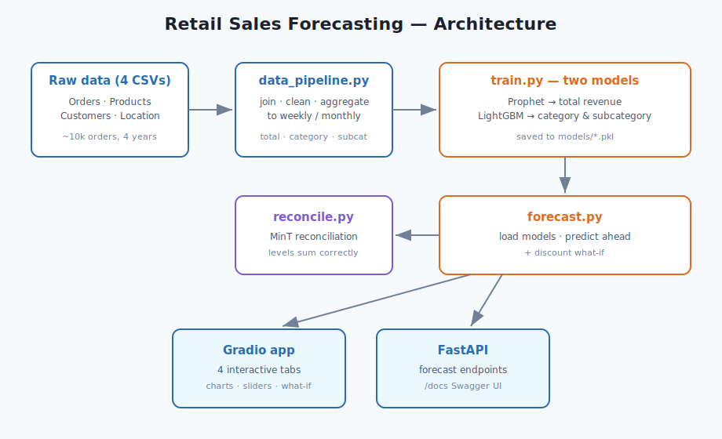
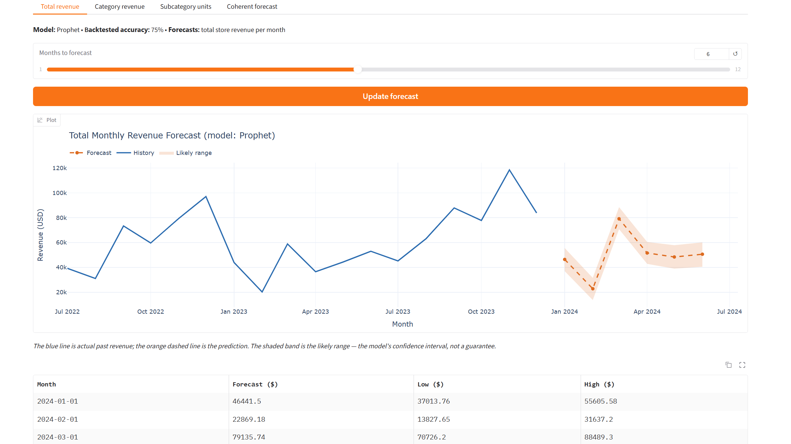
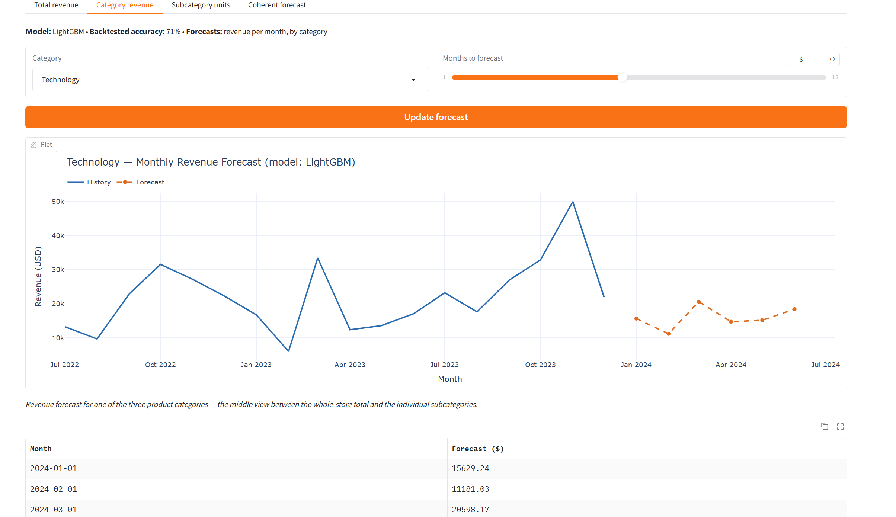
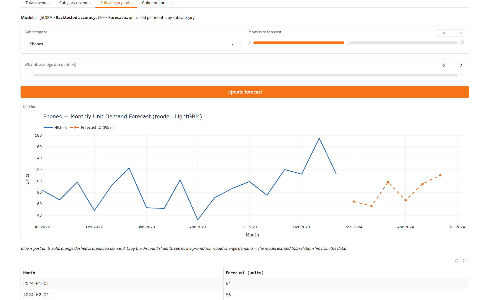
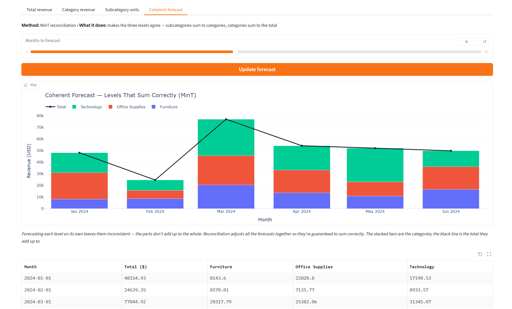

# Retail Sales Analytics & Forecasting

This project predicts a retail store's future sales from four years of its
past orders. It forecasts at three levels of detail - total sales, sales by
product category, and unit demand by sub-category - and serves the results
as an interactive web app and a web API.

It uses two well-known forecasting tools, **Prophet** and **LightGBM**, adds
**hierarchical reconciliation** so the three levels always add up, and is
fully runnable with **Docker**. The data is the classic Superstore dataset:
about 10,000 orders over four years, 17 sub-categories, and ~$2.3M in sales.

**Live demo:** 
`https://huggingface.co/spaces/<your-username>/retail-sales-forecasting`

**Tableau dashboards:**
[View on Tableau Public](https://public.tableau.com/app/profile/yash.takte/viz/SCDashboard_17664144788230/SalesDashboard?publish=yes)

---

## What the project does

A store has years of sales records but wants to know what's coming next -
how much it will sell next quarter, which categories will grow, and how many
units of each product to stock. This project answers that. It cleans the raw
order data, learns the patterns in it (the steady upward trend, the November
holiday spike, the quiet February), and projects those patterns forward.

Because a single number for the whole store isn't enough for planning, it
forecasts at three levels:

- **Total** - the whole store's revenue each month (the big-picture view).
- **Category** - revenue for each of the three product groups (Furniture,
  Office Supplies, Technology).
- **Sub-category** - unit demand for each of the 17 product types, which is
  what you'd actually use to decide how much to order.

It then reconciles these so they're consistent - the sub-categories add up to
the categories, which add up to the total - and lets you explore everything
through interactive charts, including a "what if we ran a discount?" slider.

## Architecture



The flow is: raw CSVs → cleaned and aggregated tables → two models trained
and saved → a reconciliation step that makes the levels coherent → served
through a Gradio app and a FastAPI service.

## Models and why each was chosen

| Level | Forecasts | Model | Why |
|-------|-----------|-------|-----|
| Total | Monthly revenue | Prophet | Best on a short, seasonal series |
| Category | Monthly revenue | LightGBM | Learns from all 3 series together |
| Sub-category | Monthly units | LightGBM | Learns from all 17 series together |

Sub-categories are forecast in **units** rather than dollars, because at that
level one large order swings the dollar figure wildly while unit demand stays
steady - and units are what you stock against.

## Results

Accuracy is measured honestly: the models are tested on months they never saw
during training, repeated across six rolling time windows so the number is
stable rather than a single lucky split. Accuracy here means `100 − WMAPE`, a
standard demand-forecasting measure.

| Level | Model | Backtested accuracy |
|-------|-------|--------------------|
| Total revenue | Prophet | **~73%** |
| Category revenue | LightGBM | **~72%** |
| Sub-category units | LightGBM | **~72%** |

For the hierarchical reconciliation, the key result is about consistency, not
a big accuracy jump:

| Approach | Accuracy (all levels) | Total level | Do the levels add up? |
|----------|----------------------|-------------|------------------------|
| Forecast each level separately | 58.5% | 74.9% | No - off by ~$11,000 |
| MinT reconciliation | 58.2% | **75.8%** | **Yes - exactly** |

In other words, reconciliation makes the forecasts consistent for free, and
even nudges the top-level number up slightly. On a dataset this small and
bumpy, that honesty - coherence without sacrificing accuracy - is the point.

## The web app

Run the Gradio app and you get four tabs. Every tab shows a chart the moment
the page loads, so there's never a blank screen. All charts are interactive -
hover to read values, drag to zoom, double-click to reset - with month names
on the axis.

**Total revenue** - whole-store revenue forecast (Prophet), shown with a
shaded "likely range" so the prediction isn't a single false-precision number.

**Category revenue** - revenue forecast for one of the three categories.

**Sub-category units** - unit-demand forecast for any of the 17 sub-categories,
with a **discount slider**: drag it to see how a promotion would change demand.

**Coherent forecast** - the reconciled view, with the three categories stacked
under the total they sum to.

### Screenshots









## Project layout

```
retail-sales-forecasting/
├── data/
│   ├── raw/             the four original CSV files
│   └── processed/       cleaned tables the code builds for you
├── src/
│   ├── config.py            file paths and settings
│   ├── data_pipeline.py     turns raw files into clean tables
│   ├── features.py          prepares inputs for LightGBM
│   ├── metrics.py           measures forecast accuracy
│   ├── model_prophet.py     the Prophet model
│   ├── model_lightgbm.py    the LightGBM model
│   ├── train.py             trains the models and saves them
│   ├── backtest.py          the honest accuracy check
│   ├── reconcile.py         makes the three levels sum correctly (MinT)
│   ├── reconcile_report.py  compares reconciliation methods
│   └── forecast.py          loads saved models to predict ahead
├── app/gradio_app.py     the Gradio web app (UI definition)
├── app.py                entry point (used by Hugging Face Spaces)
├── api/main.py           the FastAPI web service
├── docs/architecture.svg the diagram above
├── models/               where trained models get saved
├── requirements.txt
├── Dockerfile
└── docker-compose.yml
```

## How to run it locally

You'll need Python 3.10, 3.11 or 3.12. From the project folder:

```bash
python -m venv .venv
.venv\Scripts\activate            # Windows
# source .venv/bin/activate       # Mac / Linux

python -m pip install --upgrade pip
pip install -r requirements.txt

python src/data_pipeline.py       # build the clean tables
python src/train.py               # train models (prints accuracy)
python src/backtest.py            # optional: honest accuracy check
python src/reconcile_report.py    # optional: reconciliation comparison

python app/gradio_app.py          # launch the app -> http://127.0.0.1:7860
```

Prefer the API? `uvicorn api.main:app --reload --app-dir .` then open
`http://127.0.0.1:8000/docs`.

## How to run it with Docker

```bash
docker compose up --build
```

Starts the app (http://localhost:7860) and the API
(http://localhost:8000/docs) together.

## The API endpoints

| Request | What it returns |
|---------|-----------------|
| `GET /health` | a quick "I'm alive" check |
| `GET /categories` | the 3 category names |
| `GET /subcategories` | the 17 sub-category names |
| `GET /metrics` | accuracy from the last training run |
| `GET /forecast/total?months=6` | total revenue forecast with a likely range |
| `GET /forecast/category/{name}?months=6` | category revenue forecast |
| `GET /forecast/subcategory/{name}?months=6&discount=0.3` | unit demand forecast |
